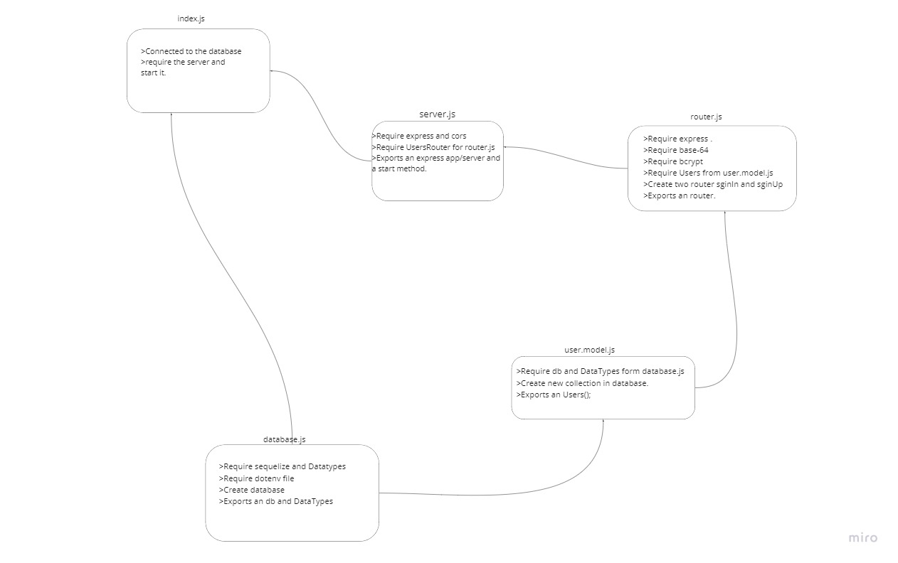

# basic-auth
An authentication system  

## Heroku link  
[Heroku link](https://obieda-basic-auth.herokuapp.com/users)

## PR
[PR](https://github.com/Oubaida996/basic-auth/pull/1)  

## Actions
[Action](https://github.com/Oubaida996/basic-auth/actions)

router.get('/users')  

/signUp  
/signIn
  {
    
    "userName": "test",
    "pwd": "test"
    
  }
  
  ## UML  
  